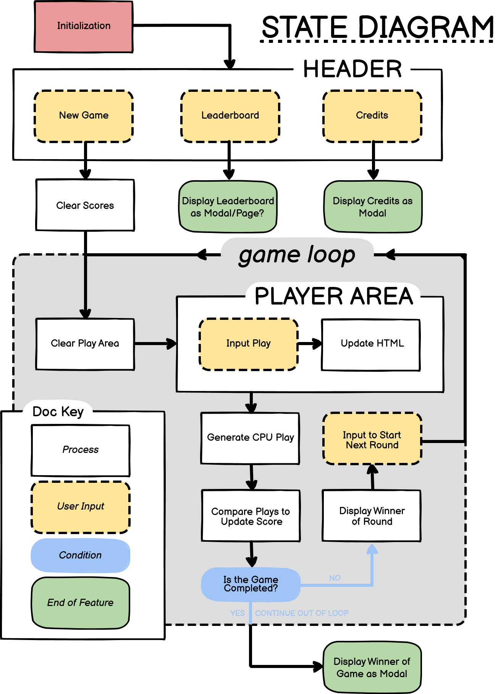

#  Rock, Paper, Scissors, Lizard, Spock: a web-based game.
## Overview
**Live link:** 

### Purpose
A web-based, fully functional game, where Users go against our code in games of Rock, Paper, Scissors, Lizard, Spock.

### Target Audience
Bored people.

### User Stories
- **As a, ... I can:** ... **...so that:**

### Wireframes

## Considerations
### Technology
#### Design:
- **...:** ...
### Accessibility
- **...:** ...
### Aesthetics
- **...:** …
#### Art:
- **...:** …

## Features
Features in this project have been prioretized using MoSCoW.
### Must-Haves
- **...:** …
### Could-Haves
- **...:** …
### Should-Haves
- **...:** …
### Won't-Haves
- **...:** …

## Application States
### State Diagram

## Deployment
### Going Live

### Testing Results

### Validation

---
***Dependencies:***
