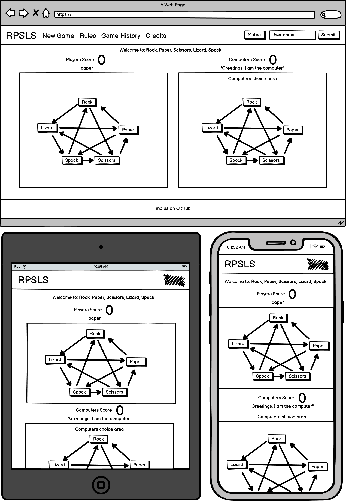

#  Rock, Paper, Scissors, Lizard, Spock: a web-based game.


## Overview

**Live link:** [https://surfdemon.github.io/CI-RPSLS/](https://surfdemon.github.io/CI-RPSLS/)
 
### Rules


### Purpose
A web-based, fully functional game, where Users go against our code in games of Rock, Paper, Scissors, Lizard, Spock. It generates a response to one of the five moves, and compares it to the user's inputted move using game rules to determine a winner.

### Target Audience
Lovers of Star Trek, The Big Bang Theory, and anyone who interacts frequently with geek space; or someone wanting to become familiar with the rules of Rock, Paper, Scissors, Lizard, Spock; or someone who knows the game, and wants to enjoy playing it against random computer generated responses.

### Wireframes


### User Stories
Features in this project have been prioretized using MoSCoW.
- **As a** user, **I want to be able to:** play a game **so that:** I derive enjoyment from it.
>[*Must-Have | Epic:* Primarily, this is a web-application for entertainment. We are developing a game. This story encompasses a number of features.]

- **As a** player, **I want to be able to:** select a move (rock, paper, scissors, lizard, Spock) **so that:** I can compete against the computer.
>[*Must-Have:* To be able to select a move is the solitary game mechanic. Other features like score keeping and leaderboards will develop the environment around the game itself, and enrichen the user experience.]

- **As a** user, **I want to be able to:** play against the computer **so that:** I can play it on my own.
>[*Must-Have:* By selecting an option from rock, paper, scissors, lizard, spock and comparing it to a player's input given the game's rules, we facilitate this user story. And doing so is much simpler that than it would be to platform for two seperate users.]

- **As a** player, **I want to be able to:** see the history of my games with the CPU **so that:** I can keep track of my victories again it.
>[*Should-Have:* In the realm of features which can be added to a basic rock, paper, scissors, lizard, spock game to enhance the experience, logging data of what is already being tracked to the user's local storage is relatively simple, but adds a large amount of value to the experience.]

- **As a** user of the game history feature, **I want to be able to:** read my win rate against the computer **so that:** I'll know how successful against it have been.
- **As a** user of the game history feature, **I want to be able to:** reset my history with the CPU **so that:** I can have another shot at improving my win-rate against it.
>[*Could-Have:* These stories represent meaningful features that if built upon the game history feature, would make it more adapted to the user's needs.]

- **As a** user, **I want to be able to:** to create a user name **so that:** I can identify with my score.
>[*Could-Have:* By including a leaderboard, players could submit their accomplishments against the computer under a user name. In this way, they can compete with other user's of the application.]

- **As a** user, **I want to be able to:** to have a mute button **so that:** I can control audio distractions while using other features or interacting with content in a quiet environment.
>[*Could-Have:* By including a mute button, players can limit distractions and have other tabs playing audio to allow them a greater user experience.]

- **As a** player, **I want to be able to:** hear responsive audio **so that:** I know intuitively when I have won or lost.
- **As a** player, **I want to be able to:** read the CPU's thoughts on the game **so that:** I can enjoy a running commentary.
>[*Could-Have:* These additions are strictly cosmetic, but enhance the experience. By displaying comments that emmulate an opponent's commentarye about the game, and playing audio at the ends of rounds, victories and defeats feel more impactful.]

- **As a** player, **I want to be able to:** see my score on a global ranking **so that:** I can compete with others for the top score.
- **As a** user, **I want to be able to:** play against another human **so that:** I can play against friends and others on the site.
>[*Won't-Have:* Given the technologies selected for this product, platforming one game for two user's, or storing data from user games with the CPU is beyond the scope of what we will accomplish in this project. These options could be made possible by incorperating real-time, or database softwares into the backend of the application's stack.]

- **As a** player, **I want to be able to:** specify the number of tries I get to win **so that:** the game can be made harder.
- **As a** player, **I want to be able to:** change the difficulty level **so that:** I can challenge myself.
>[*Wont-Have:* Both of these stories encompass the same feature. Since the computer will be making it's choices at random, there is no meaningful way to increase it's difficulty on a round to round basis. ]

## Considerations
### Technology
- **Bootstrap:** The stack for this application is exclusively Bootstrap, and it is our largest dependency. Bootstrap enables us to create clear, pre-formatted components, and cuts down on the demands for time spent in CSS development.
### Accessibility
- **HTML Structuring:** The web application is organized into header, main and footer tags for tools such as search engines and page readers. Due to the nature of this website, there is  a greater challenge present in attemping to maintain functionality if CSS is disabled. The website will not meet it's purpose without Javascript enabled.
### Aesthetics
- **Colour Scheme:** We used Coolors to find a colourscheme for our application, and chose a scheme with tones to draw out the inclusion of lizard and spock in the otherwise traditional rock, paper, scissors paragon (green and blue)
- **Bootstrap:** The components provided by Bootstrap are simple, and highly customizeable. Given the projects limitted visual design demands, this is more than a desireable amount of developmental agency.
- **SVGs:** For the game buttons, we used Claude AI to generate SVG files for each choice's icon. These came out to be simple, fun, and small enough to imploy without dependencies.


## Application States
### State Diagram


## Deployment
### Going Live
**GitHub Pages:** For this project,we chose to favour an early deployment for testing reasons. For a web application which is very Javascript focused, this proved vital for speeding up the debugging process, and addressing a littany of small issues which would arise throughout. By accessing Settings -> Pages and deploying from the main root branch, we are able to have a live public deployment of our main branch.

### Testing Results
**Browser Dev Tools - Console:** By openning dev tools in the deployment, or local port of our working branches using python3's http.server method in gitpod, we were able to view the console, and see where syntax errors were occuring in our script.js file.

For example, the computer dialogue options are stored in arrays that are randomly selected from, and the arrays are stored in one object. In initially writing the line of code responsible for fetching the computer's dialogue, no consideration was made for how the value of playerChoice would need to be used to select which property of the computer dialogue object to use for pulling a random element out of said property's array. Writing this in one line of code meant a syntax error:

```document.getElementById("CPUsay").innerHTML = CPUverbs.playerChoice[Math.floor(Math.random()*CPUverbs.playerChoice.length)];```

because the name 'playerChoice' did not corresponde to a property inside CPUverbs, this code did not function. Debugging using the browser's dev tools, as well as console logs written into the script.js file helped locate this problem, and why the dialogue lines were returning as undefined. After some research, we found that an index selection syntax could be used with objects, where playerChoice could be evalutated as a value for the index of CPUverbs. This made the line of code function.

```document.getElementById("CPUsay").innerHTML = CPUverbs[playerChoice][Math.floor(Math.random()*CPUverbs[playerChoice].length)];```

## Validation
### HTML Validation


### CSS Validation


---
*Dependencies:*

Sheldon Clip: [https://youtu.be/pIpmITBocfM](https://youtu.be/pIpmITBocfM)

Font Awesome: [https://fontawesome.com](/https://fontawesome.com/)

Claude AI: [https://claude.ai/](https://claude.ai/)

Favicon.io: [https://favicon.io/](https://favicon.io/)

Coolors: [https://coolors.co/](https://coolors.co/)

click-buttons-ui-menu.mp3 Sound Effect by <a href="https://pixabay.com/users/skyscraper_seven-43500092/?utm_source=link-attribution&utm_medium=referral&utm_campaign=music&utm_content=203601">Rusu Gabriel</a>

HTML Validator: [https://validator.w3.org](https://validator.w3.org)

CSS Validator: [https://jigsaw.w3.org/css-validator/](https://jigsaw.w3.org/css-validator/)
