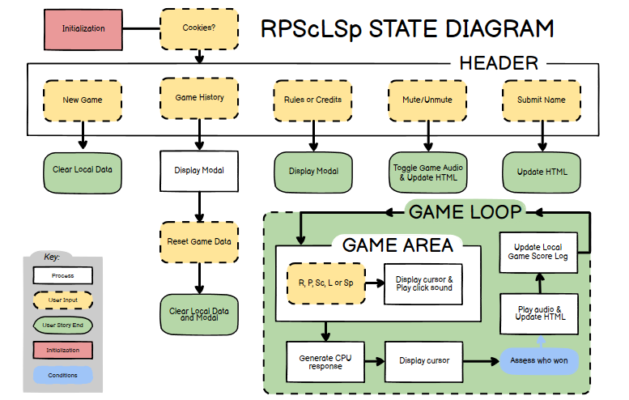

#  Rock, Paper, Scissors, Lizard, Spock: a web-based game.
## Overview
**Live link:** 
### Rules

### Purpose
A web-based, fully functional game, where Users go against our code in games of Rock, Paper, Scissors, Lizard, Spock.

### Target Audience
Bored people.

### Wireframes

### User Stories
Features in this project have been prioretized using MoSCoW.
- **As a** user, **I want to be able to:** play a game **so that:** I derive enjoyment from it.
>[*Must-Have | Epic:* Primarily, this is a web-application for entertainment. We are developing a game. This story encompasses a number of features.]

- **As a** player, **I want to be able to:** select a move (rock, paper, scissors, lizard, Spock) **so that:** I can compete against the computer.
>[*Must-Have:* To be able to select a move is the solitary game mechanic. Other features like score keeping and leaderboards will develop the environment around the game itself, and enrichen the user experience.]

- **As a** user, **I want to be able to:** play against the computer **so that:** I can play it on my own.
>[*Must-Have:* By selecting an option from rock, paper, scissors, lizard, spock and comparing it to a player's input given the game's rules, we facilitate this user story. And doing so is much simpler that than it would be to platform for two seperate users.]

- **As a** player, **I want to be able to:** specify the number of tries I get to win **so that:** the game can be made harder.
- **As a** player, **I want to be able to:** change the difficulty level **so that:** I can challenge myself.
>[*Should-Have:* Both of these stories encompass the same feature. Since the computer will be making it's choices at random, there is no meaningful way to increase it's difficulty on a round to round basis. However, by allowing the player to adjust the number of wins they must make to win, we can facilitate these stories in a similar way.]

- **As a** player, **I want to be able to:** see the history of my games with the CPU **so that:** I can keep track of my victories again it.
>[*Should-Have:* In the realm of features which can be added to a basic rock, paper, scissors, lizard, spock game to enhance the experience, logging data of what is already being tracked to the user's local storage is relatively simple, but adds a large amount of value to the experience.]

- **As a** user of the game history feature, **I want to be able to:** read my win rate against the computer **so that:** I'll know how successful against it have been.
- **As a** user of the game history feature, **I want to be able to:** reset my history with the CPU **so that:** I can have another shot at improving my win-rate against it.
>[*Could-Have:* These stories represent meaningful features that if built upon the game history feature, would make it more adapted to the user's needs.]

- **As a** user, **I want to be able to:** to create a user name **so that:** I can identify with my score.
>[*Could-Have:* By including a leaderboard, players could submit their accomplishments against the computer under a user name. In this way, they can compete with other user's of the application.]

- **As a** player, **I want to be able to:** hear responsive audio **so that:** I know intuitively when I have won or lost.
- **As a** player, **I want to be able to:** read the CPU's thoughts on the game **so that:** I can enjoy a running commentary.
>[*Could-Have:* These additions are strictly cosmetic, but enhance the experience. By displaying comments that emmulate an opponent's commentarye about the game, and playing audio at the ends of rounds, victories and defeats feel more impactful.]

- **As a** player, **I want to be able to:** see my score on a global ranking **so that:** I can compete with others for the top score.
- **As a** user, **I want to be able to:** play against another human **so that:** I can play against friends and others on the site.
>[*Won't-Have:* Given the technologies selected for this product, platforming one game for two user's, or storing data from user games with the CPU is beyond the scope of what we will accomplish in this project. These options could be made possible by incorperating real-time, or database softwares into the backend of the application's stack.]

## Considerations
### Technology
- **Youtube Embeds:** ...
- **Bootstrap:** The stack for this application is exclusively Bootstrap, and it is our largest dependency. Bootstrap enables us to create clear, pre-formatted components, and cuts down on the demands for time spent in CSS development.
### Accessibility
- **...:** ...
### Aesthetics
- **Bootstrap:** The components provided by Bootstrap are simple, and highly customizeable. Given the projects limitted visual design demands, this is more than a desireable amount of developmental agency.
- **SVGs:** For the game buttons, we used Claude AI to generate SVG files for each choice's icon. These came out to be simple, fun, and small enough to imploy without dependencies.

## Application States
### State Diagram

## Deployment
### Going Live

### Testing Results

### Validation

---
***Dependencies:***

**click-buttons-ui-menu.mp3** Sound Effect by <a href="https://pixabay.com/users/skyscraper_seven-43500092/?utm_source=link-attribution&utm_medium=referral&utm_campaign=music&utm_content=203601">Rusu Gabriel</a> from <a href="https://pixabay.com//?utm_source=link-attribution&utm_medium=referral&utm_campaign=music&utm_content=203601">Pixabay</a>
